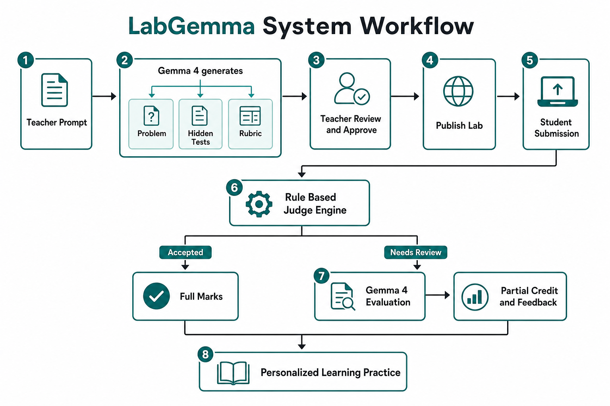

<h1 align="center">LabGemma</h1>

<p align="center">
  <strong>AI Assisted Programming Lab Evaluation and Personalized Learning Platform Powered by Gemma 4</strong>
</p>

<p align="center">
  <strong>Making programming lab assessment fair, explainable, and personalized.</strong>
</p>

<p align="center">
  <a href="https://labgemma.onrender.com/"></a>
  <a href="https://youtu.be/c0eE0mIEzUg"></a>
  <a href="https://arxiv.org/abs/2503.23989"></a>
  <a href="https://ollama.com/library/gemma4"></a>
</p>

<p align="center">
  <a href="#features">Features</a> ·
  <a href="#system-workflow">Workflow</a> ·
  <a href="#technology-stack">Tech Stack</a> ·
  <a href="#getting-started">Installation</a> ·
  <a href="#future-work">Future Work</a>
</p>

---

## Overview

**LabGemma** is an AI assisted programming laboratory platform that helps instructors design programming labs, evaluate student submissions fairly, and generate personalized learning recommendations using **Gemma 4**.

Traditional online judges focus only on whether a submission passes predefined test cases. Students whose solutions fail because of minor mistakes often receive zero marks without understanding what they did correctly or where they need improvement.

LabGemma introduces a **hybrid evaluation pipeline** that combines deterministic code execution with AI assisted rubric evaluation. Instead of replacing conventional judging, Gemma 4 complements it by providing explainable partial credit assessment and individualized feedback while keeping teachers in control of the grading process.

The platform is designed for programming courses at universities, coding bootcamps, and training institutes.

---

## Why LabGemma?

Programming courses are becoming larger every year, making manual evaluation increasingly difficult.

Instructors spend considerable time:

* Designing programming assignments
* Writing grading rubrics
* Creating hidden test cases
* Reviewing submissions manually
* Providing personalized feedback
* Preparing additional practice materials

Existing online judges solve only part of the problem by checking correctness through automated test cases.

However, they cannot:

* Award meaningful partial marks
* Explain why a submission failed against a rubric
* Identify student misconceptions from lab history
* Recommend targeted practice inside the same platform
* Keep teachers in control of every AI suggested score

LabGemma bridges this gap by integrating **Gemma 4** into the assessment workflow while maintaining the reliability of rule based judging.

---

## Features

| Feature | Description |
| ------- | ----------- |
| AI Problem Generation | Generate complete programming problems from instructor prompts |
| Hidden Test Generation | Automatically create hidden evaluation test cases |
| Rubric Generation | Produce detailed question specific grading rubrics |
| Teacher Review | Teachers review and approve AI generated content before publishing |
| Rule Based Judge | Execute code against sample and hidden test cases (C, C++, Python, Java) |
| Partial Credit Evaluation | Award fair marks for partially correct submissions |
| Consistency Check | Verify AI scores against the approved rubric and judge result |
| Explainable Feedback | Provide structured criterion level feedback instead of only WA / CE / RE |
| Teacher Override | Instructors can edit or override every AI suggested mark |
| Personalized Learning | Recommend and generate targeted practice from weak areas |
| Lab Sessions | Create, activate, and manage timed lab sessions |
| Submissions View | Teachers review student results in a clear matrix style page |

---

## System Workflow

<p align="center">
  
</p>

---

## Gemma 4 Integration

Gemma 4 is the only LLM in LabGemma and the intelligence layer of the product.

It is responsible for:

* Programming problem generation
* Hidden test case generation
* Question specific rubric generation
* Partial credit evaluation
* Rubric consistency verification
* Student performance analysis
* Personalized practice problem generation

Traditional components such as the judge engine, database, and web application ensure deterministic execution and data management, while Gemma 4 enhances assessment quality through intelligent reasoning.

---

## Technology Stack

| Category | Technology |
| -------- | ---------- |
| Backend | FastAPI |
| Frontend | Jinja2 Templates |
| Database | SQLite |
| ORM | SQLAlchemy |
| Authentication | Session Authentication |
| AI Model | Gemma 4 (Ollama Cloud by default) |
| HTTP Client | httpx |
| Judge Engine | Custom Lightweight Judge |
| Supported Languages | C, C++, Python, Java |
| Deployment | Docker, Render |

---

## Project Structure

```text
labgemma/
├── app/
│   ├── routers/          # auth, teacher, student, learning
│   ├── services/         # Gemma client, generation, grading, judge, learning
│   ├── templates/        # HTML UI
│   ├── static/           # CSS and assets
│   ├── main.py
│   ├── models.py
│   ├── database.py
│   ├── auth.py
│   └── config.py
├── scripts/
│   └── seed_demo.py
├── Dockerfile
├── docker-compose.yml
├── docker-entrypoint.sh
├── requirements.txt
├── .env.example
└── README.md
```

---

## Getting Started

### Clone Repository

```bash
git clone https://github.com/Noman-797/labgemma.git
cd labgemma
```

### Using Docker (recommended)

```bash
cp .env.example .env
# set GEMMA_API_KEY, or set MOCK_GEMMA=1 for offline demo

docker compose up --build -d
```

Open [http://127.0.0.1:8000](http://127.0.0.1:8000)

Useful commands:

```bash
docker compose logs -f
docker compose down
```

### Local Development

Needs Python 3.11+ and, for non Python labs, `gcc` / `g++` / `javac`.

```bash
python3 -m venv venv
source venv/bin/activate
pip install -r requirements.txt
cp .env.example .env
python scripts/seed_demo.py
uvicorn app.main:app --reload --host 127.0.0.1 --port 8000
```

### Environment

```env
SECRET_KEY=change-me
DATABASE_URL=sqlite:////data/labgemma.db
GEMMA_API_KEY=your_key
GEMMA_API_BASE_URL=https://ollama.com/v1
GEMMA_MODEL=gemma4:31b-cloud
MOCK_GEMMA=0
SEED_DEMO=1
```

See `.env.example` for all options.

---

## Live Demo

**Application:** [https://labgemma.onrender.com](https://labgemma.onrender.com/)  
**Workflow video:** [https://youtu.be/c0eE0mIEzUg](https://youtu.be/c0eE0mIEzUg)

> Free hosting may cold start on the first request. Health check: `/health`

### Demo Accounts

**Teacher**

```text
Email: teacher@demo.com
Password: teacher123
```

**Student**

```text
Email: abdnoman093@gmail.com
Password: student123
```

**Student 2**

```text
Email: student2@demo.com
Password: student123
```

---

## Demonstration Flow

1. Log in as a Teacher.
2. Create a lab session and generate a problem with Gemma 4.
3. Review the generated problem, hidden test cases, and grading rubric.
4. Approve and activate the lab for students.
5. Log in as a Student (set Student ID in Profile if entering a live lab).
6. Solve the programming assignment in the editor.
7. Run a sample test, then submit the final solution.
8. View judge results.
9. If tests fail, review AI generated partial evaluation.
10. Open Learning for personalized practice based on weak topics.

---

## Future Work

* Stronger isolation for student code execution
* LMS integration (Moodle, Google Classroom)
* Multi course management
* Advanced instructor analytics
* Learning history visualization
* Peer review support
* Contest mode
* Cloud based scalable judge infrastructure

---

## Limitations

* Prototype for education and hackathon demos, not full exam proctoring
* Student code runs in temporary directories inside the app container
* Free PaaS disks can reset on redeploy; use `SEED_DEMO=1` to restore demo accounts

---

## License

This project is licensed under the **MIT License**.

---

## Acknowledgements

LabGemma was developed as an AI powered educational platform inspired by research on rubric guided LLM evaluation in programming education, including *Rubric Is All You Need* (Pathak et al., ICER 2025). The project shows how deterministic code evaluation and large language models can work together to provide fair, explainable, and personalized assessment.

---

<h2 align="center">Author</h2>

<p align="center">
  <strong>Abdullah Al Noman</strong><br><br>
  Computer Science and Engineering<br>
  Daffodil International University<br>
  A Concern of Semicolons<br><br>
  Portfolio: <a href="https://abdnoman.com">abdnoman.com</a>
</p>
