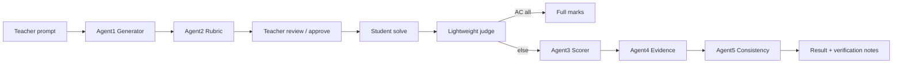

# LabGemma

**A Concern of Semicolons** — AI-assisted programming lab with personalized learning.

**Teachers generate lab problems & rubrics with Gemma; students submit code; a small Gemma agent pipeline marks with partial credit and verifies scores to reduce hallucination.**

Hackathon prototype of the **Semicolons lab evaluation flow**, rebuilt with **FastAPI** and **Gemma-only** LLM calls (no Groq / other LLMs).

## Why

University lab exams need partial credit, not only AC/WA. Manual rubric marking is slow. A single LLM call can hallucinate scores — LabGemma uses a short agent pipeline (Scorer → Evidence → Consistency) to reduce that risk.

## Flow (same as Semicolons labs)



1. Teacher creates **Lab Session**
2. **Add Problem**: `ai_prompt`, language, difficulty, `rubric_prompt`, `total_marks`
3. Gemma **Agent1** generates problem + samples + test cases
4. Gemma **Agent2** generates rubric (marks sum = total)
5. Teacher **review / edit / approve** (`rubric_approved`)
6. Activate session → students see approved problems
7. Student **Test** (sample) / **Final submit** (once)
8. Lightweight judge; full AC → full marks; else AI partial + evidence + verify
9. Teacher can view submissions / override marks

## Out of scope (intentionally)

Per-submission Docker sandbox, Celery/Redis, WebSockets, contests, department admin portal.

## Stack

- FastAPI + Jinja2 + SQLite
- SQLAlchemy 2
- Gemma 4 via OpenAI-compatible HTTP API (`httpx`) — Ollama Cloud by default
- Lightweight judge: Python / C / C++ / Java (`gcc`, `g++`, `javac` in Docker image)
- `MOCK_GEMMA=1` for offline demo

## Quick start (Docker — recommended)

```bash
cd ~/Downloads/labgemma
cp .env.example .env
# Add GEMMA_API_KEY (or set MOCK_GEMMA=1)

docker compose up --build -d
```

Open http://127.0.0.1:8000

- App image includes Python + `gcc` / `g++` / JDK for judging
- SQLite data persists in Docker volume `labgemma_data`
- Demo accounts are seeded when `SEED_DEMO=1` (default)

Useful commands:

```bash
docker compose logs -f          # logs
docker compose down             # stop
docker compose up --build -d    # rebuild after code changes
```

Deploy anywhere that runs Docker (Render, Railway, Fly.io, AWS EC2, VPS):

```bash
docker build -t labgemma .
docker run -d --name labgemma -p 8000:8000 --env-file .env \
  -e DATABASE_URL=sqlite:////data/labgemma.db -e SEED_DEMO=1 \
  -v labgemma_data:/data labgemma
```

Point `labgemma.abdnoman.com` at the host (A/CNAME), then put nginx/Caddy or the platform’s HTTPS in front of port 8000.

## Setup (local, without Docker)

```bash
cd ~/Downloads/labgemma
source venv/bin/activate   # already created if you used the scaffold
# or: python3 -m venv venv && source venv/bin/activate && pip install -r requirements.txt

cp .env.example .env
# MOCK_GEMMA=1 for demo without a key
python scripts/seed_demo.py
uvicorn app.main:app --reload --host 127.0.0.1 --port 8000
```

Open http://127.0.0.1:8000

### Demo accounts

| Email | Password | Role |
|-------|----------|------|
| teacher@demo.com | teacher123 | teacher |
| abdnoman093@gmail.com | student123 | student |
| student2@demo.com | student123 | student |

### Demo script (5 min)

1. Login as teacher → **New session** → **Add problem (AI)**
2. Prompt e.g. *Read n and an array, print the sum* → Review → **Approve**
3. **Activate for students**
4. Login student1 → solve with correct Python → Final submit
5. Login student2 → incomplete code → lower partial marks + evidence + verification notes

## Gemma API

Set in `.env`:

```
MOCK_GEMMA=0
GEMMA_API_KEY=your_key
GEMMA_API_BASE_URL=https://ollama.com/v1
GEMMA_MODEL=gemma4:31b-cloud
```

Client: `app/services/gemma_client.py` — adjust URL/headers if your provider differs.

## Honest limitations

- AI rubric grading prototype; not production proctoring
- Student code runs in the app container (temp dirs), not a hardened per-submission sandbox
- Free PaaS cold starts may delay the first request

## License

MIT — hackathon prototype.
